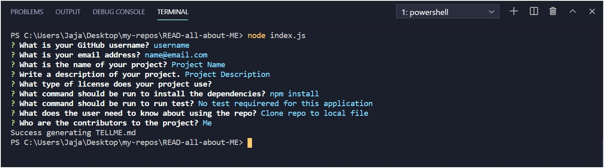
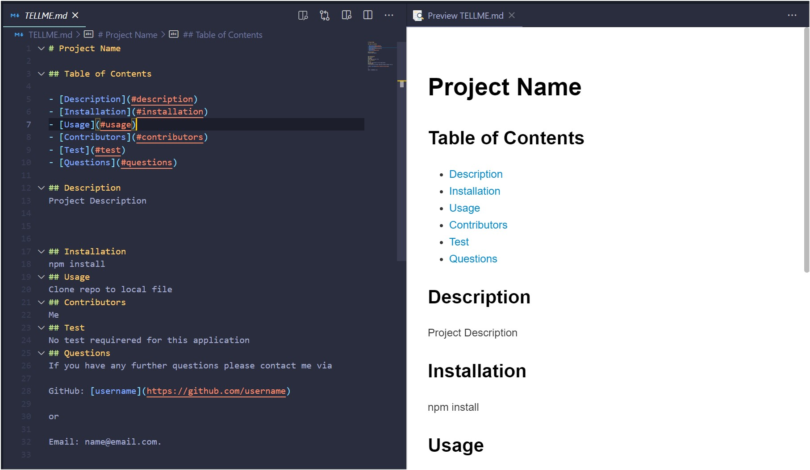

# READ-all-about-ME

## Description

Read-all-about-ME is an application ran through the command line using node.js and a package named inquirer. It gathers the users input from a series of prompts. That input is then used to generate a README.md, by populating the different sections of a template file.

## Getting Started

1. Clone repository to local directory
2. Download and install Nodejs
3. Open terminal in code editor or via machine, and run **_node index.js_**.

## Built With

- [JavaScript](https://developer.mozilla.org/en-US/docs/Web/JavaScript)
- [Nodejs](https://nodejs.org/)
- [NPM](https://www.npmjs.com/)
- [Inquirer](https://www.npmjs.com/package/inquirer)

## Deployed Link

[Live Application](https://drive.google.com/file/d/16nCD94Xa_zigH3g9qZFBwJNkWMbf6ca_/view)

Application running in the command line


Generated README file and preview


## Code Snippet

```

// * Function to create README
const generateReadMe = async () => {
  try {
    const answers = await getUserInfo();
    const markDown = markdownTemplate(answers);

    writeFileAsync("TELLME.md", markDown);
    console.log("Success generating TELLME.md");
  } catch (err) {
    console.log(err);
  }
};

generateReadMe();

```

## Authors

- **Jaja Brown**
  - [Portfolio](https://jbrown827.github.io/portfolio/)
  - [GitHub](https://github.com/jbrown827)
  - [LinkedIn](https://www.linkedin.com/in/jaja-brown-a42261201)
